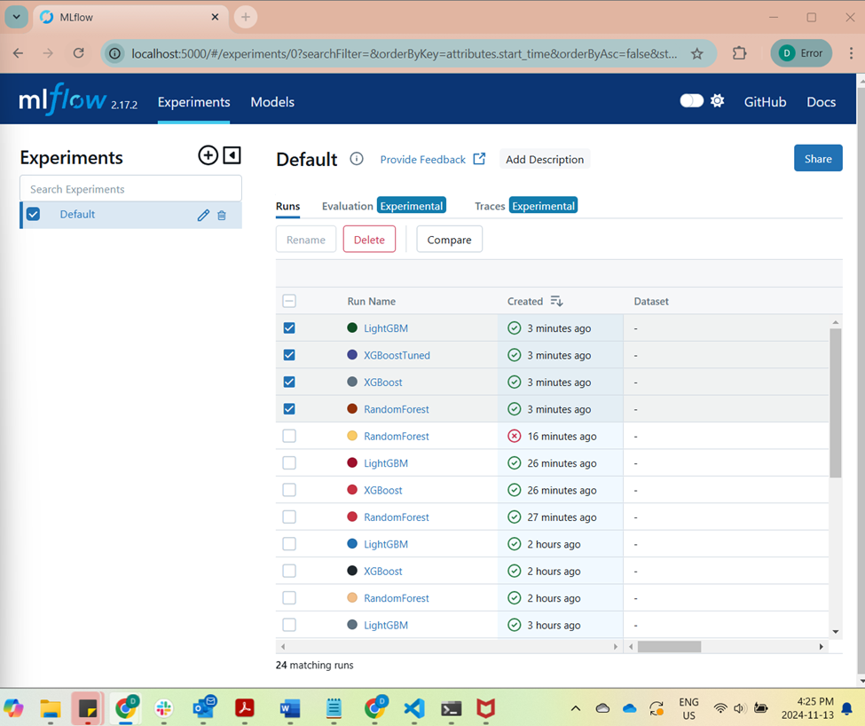
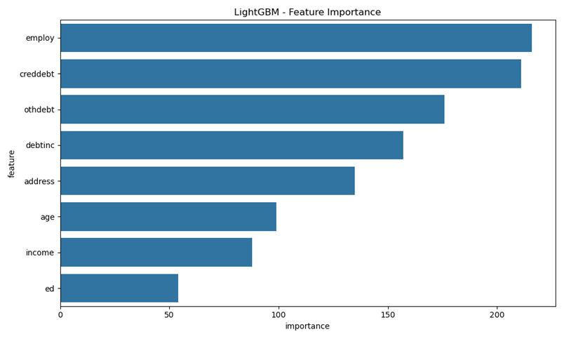
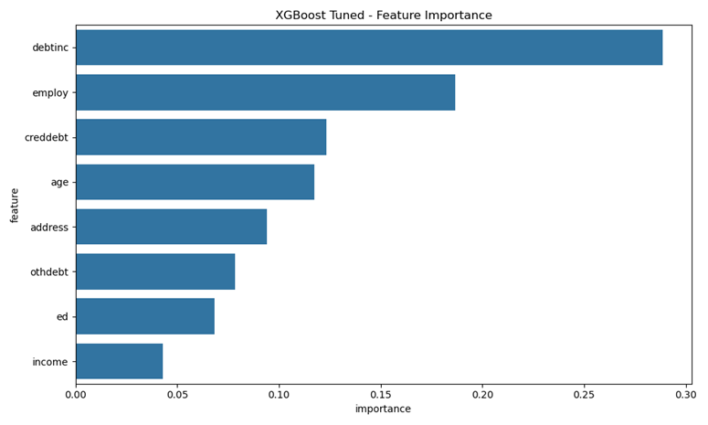
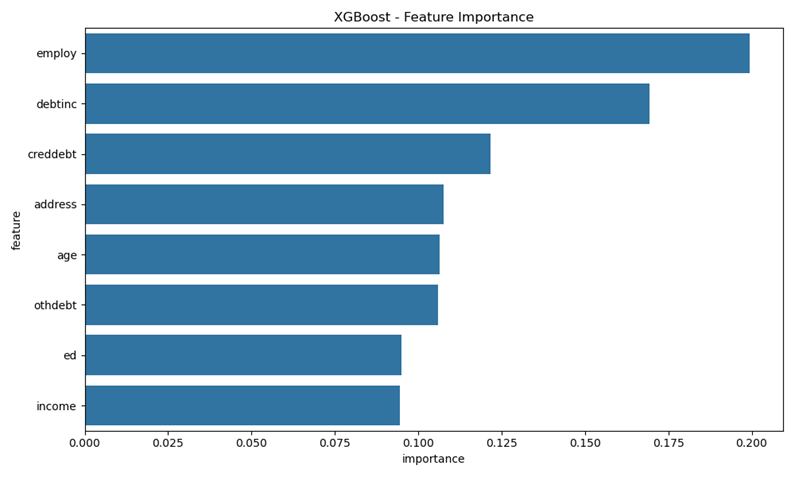
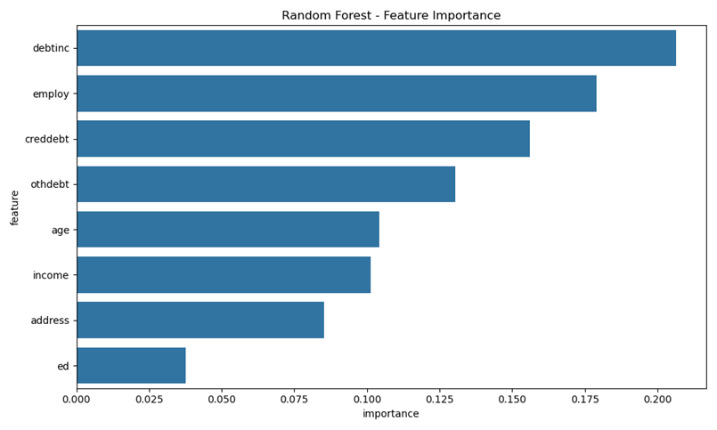
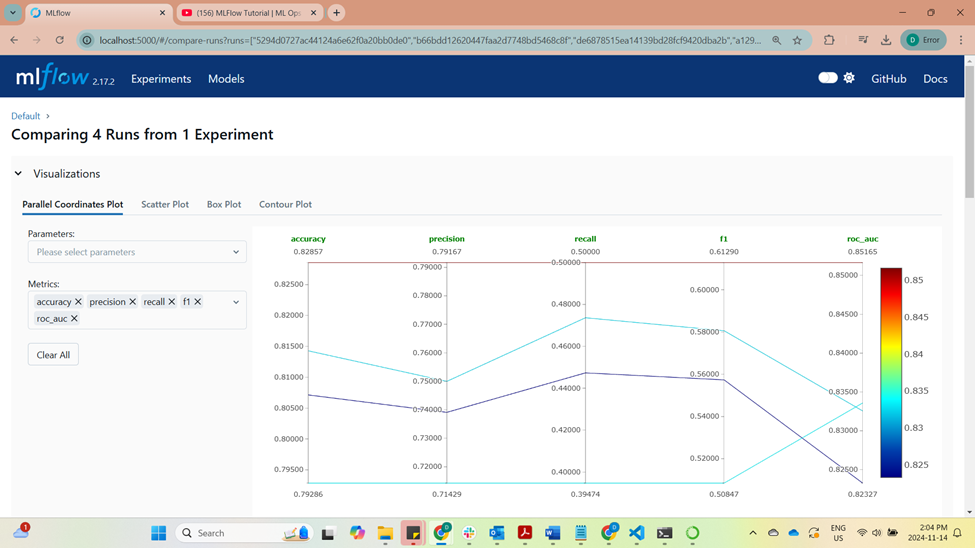
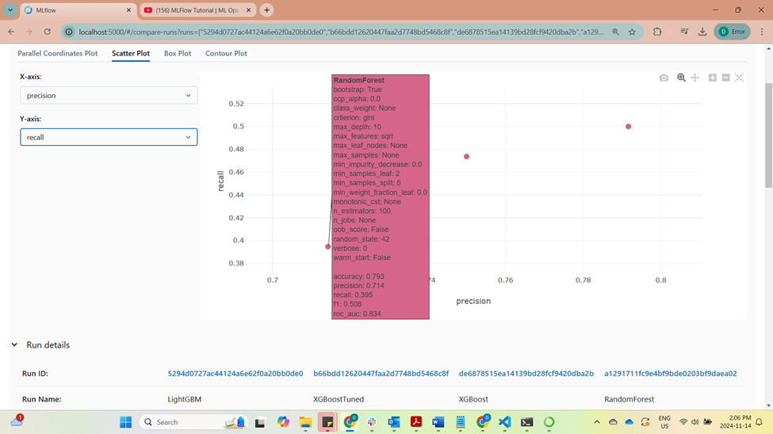

# Loan Default Prediction Model Comparison

## Overview
This document presents a comprehensive analysis of the loan default prediction models developed by our team. We leveraged MLflow to track, compare, and gain insights from the various model experiments.

## Manual Model Comparison in MLflow GUI
As a first step, we manually compared the model performances in the MLflow UI. By selecting and comparing specific model runs, we were able to dive deep into the nuanced trade-offs between the models.

## Feature Importance Comparison
Next, we analyzed the feature importance for each model to understand which factors were driving the predictions. By comparing the feature importance plots across models, we identified the key commonalities and differences.

## Parallel Coordinates Plot
To get a holistic view of the model performances, we utilized the Parallel Coordinates Plot in MLflow. This allowed us to examine the models' accuracy, precision, recall, F1-score, and ROC-AUC simultaneously.

## Precision-Recall Scatter Plot
Finally, we looked at the Precision-Recall Scatter Plot to understand the balance between precision and recall for each model. This helped us identify the models that achieved the best overall performance based on this key trade-off.

## Conclusion
Based on the comprehensive analysis using the MLflow visualizations, we determined that the Random Forest model is the most suitable choice for the loan default prediction task. While the models had similar overall performance metrics, the Random Forest model stood out for its interpretability and balanced precision-recall profile, making it the easiest to explain to the business stakeholders.